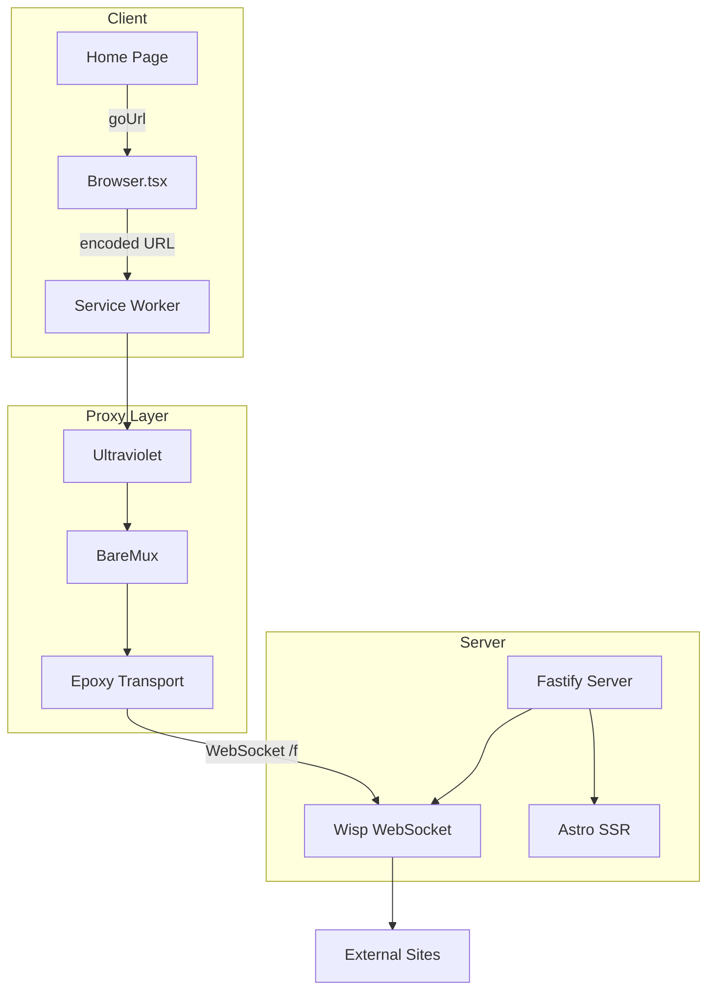
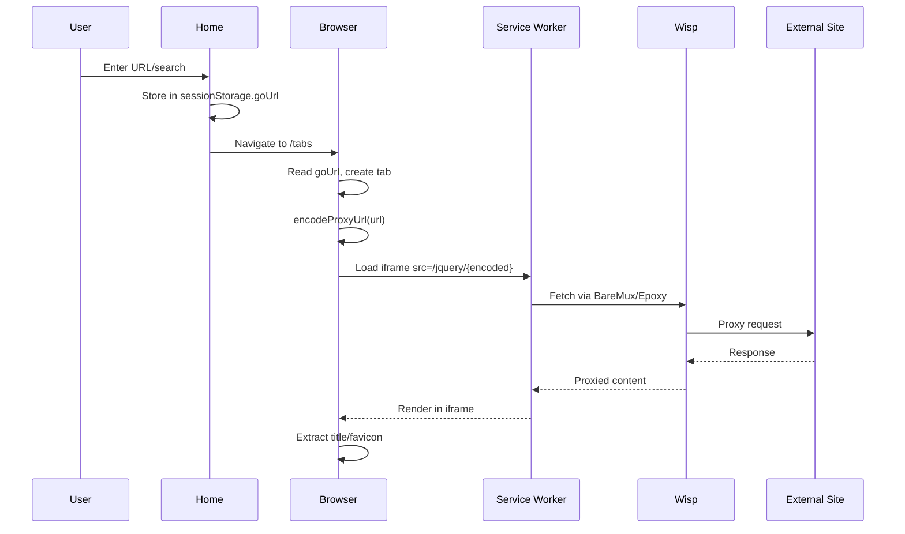

# Codebase Map

> Auto-generated by Cartographer. Last mapped: 2026-01-27

## System Overview



## Directory Structure

```
Interstellar-Astro/
├── src/
│   ├── components/      # UI components (Astro + React)
│   │   ├── Browser.tsx      # Main tabbed browser interface
│   │   ├── AssetCard.astro  # Game/app card
│   │   ├── Dropdown.astro   # Dropdown menu
│   │   └── ...
│   ├── layouts/         # Page layouts
│   │   ├── Layout.astro     # Base layout (proxy init)
│   │   └── Main.astro       # Nav layout
│   ├── lib/             # Client-side utilities
│   │   ├── global.ts        # Theme, cloaking, panic key
│   │   ├── tabs.ts          # URL encoding, tab utils
│   │   ├── settings.ts      # Settings page logic
│   │   ├── home.ts          # Search handling
│   │   └── assets.ts        # Games/apps logic
│   ├── pages/           # Routes
│   │   ├── index.astro      # Homepage search
│   │   ├── tabs.astro       # Browser view
│   │   ├── apps.astro       # Apps catalog
│   │   ├── games.astro      # Games catalog
│   │   ├── settings.astro   # Settings
│   │   └── e/[...slug].ts   # Asset proxy API
│   └── types/           # TypeScript definitions
├── public/
│   ├── sw.js                # Service worker
│   └── assets/
│       ├── bundled/         # UV, BareMux, Epoxy bundles
│       └── json/            # Games.json, Apps.json
├── index.ts             # Production Fastify server
├── config.ts            # App configuration
├── randomize.ts         # Build-time obfuscation
└── astro.config.ts      # Astro + Vite config
```

## Module Guide

### Browser Component

**Purpose:** React-based multi-tab browser UI with proxy integration

**Entry point:** `src/components/Browser.tsx`

| File        | Purpose                                               | Tokens |
| ----------- | ----------------------------------------------------- | ------ |
| Browser.tsx | Tab management, URL bar, bookmarks, window intercepts | 4,092  |

**Key Features:**

- Tab create/close/switch with state persistence
- URL encoding via UV config
- Intercepts `window.open()`, middle-click, Ctrl+click
- Favicon/title polling from iframes
- Fullscreen support

**Dependencies:** `@/lib/tabs`, `lucide-react`

---

### Client Libraries

**Purpose:** Client-side utilities for each feature domain

| File        | Purpose                                        | Tokens |
| ----------- | ---------------------------------------------- | ------ |
| global.ts   | Theme, cloaking, panic key, hamburger menu     | 1,021  |
| tabs.ts     | URL encode/decode, tab types, navigation utils | 1,094  |
| settings.ts | Settings page dropdowns and inputs             | 3,100  |
| home.ts     | Search input → goUrl → /tabs redirect          | 186    |
| assets.ts   | Games/apps card clicks, custom asset storage   | 648    |

**Patterns:**

- All run on `astro:page-load` event
- SSR-safe with `typeof window` checks
- localStorage/cookies for persistence

---

### Proxy System

**Purpose:** Ultraviolet-based web proxy with WebSocket transport

| File                            | Purpose                       | Tokens |
| ------------------------------- | ----------------------------- | ------ |
| public/sw.js                    | Service worker, routes to UV  | 94     |
| public/assets/bundled/v.cnfg.js | UV config, cipher, injections | 747    |
| Layout.astro                    | BareMux init, SW registration | 314    |

**Flow:**

1. `encodeProxyUrl()` → UV prefix + cipher-encoded URL
2. Iframe loads encoded URL
3. Service worker intercepts, uses UVServiceWorker
4. BareMux → Epoxy transport → Wisp WebSocket
5. Server proxies to external site

**Gotchas:**

- Cipher key = `origin + userAgent` (client-specific)
- Proxy prefix: `/jquery/`
- Wisp endpoint: `/f/`

---

### Server

**Purpose:** Fastify production server with SSR and WebSocket

**Entry point:** `index.ts`

| File      | Purpose                                | Tokens |
| --------- | -------------------------------------- | ------ |
| index.ts  | Fastify setup, Wisp, auth, compression | 660    |
| config.ts | Port, obfuscation, auth settings       | 157    |

**Features:**

- Auto-builds on first run (with obfuscation)
- WebSocket upgrade for Wisp at `/f`
- Optional basic auth
- Brotli/gzip compression
- Serves Astro SSR handler

---

### Build Obfuscation

**Purpose:** Randomize file/route names to evade detection

**Entry point:** `randomize.ts`

| File         | Purpose                                 | Tokens |
| ------------ | --------------------------------------- | ------ |
| randomize.ts | File rename, import rewrite, git revert | 3,818  |

**Strategies:**

- Single random char
- Base64url
- Hex
- Realistic names (dashboard, profile, etc.)

**Process:**

1. Generate mappings for components/layouts/lib/pages
2. Update all imports/references
3. Rename files
4. Build
5. Git restore to original

---

### Pages

| File           | Purpose                                   | Tokens |
| -------------- | ----------------------------------------- | ------ |
| index.astro    | Homepage with search input                | 236    |
| tabs.astro     | Browser component mount                   | 32     |
| apps.astro     | Apps catalog (SSR, reads JSON + cookies)  | 393    |
| games.astro    | Games catalog (SSR, reads JSON + cookies) | 403    |
| settings.astro | All settings UI                           | 2,366  |
| e/[...slug].ts | Asset proxy to GitHub repos               | 312    |

---

## Data Flow

### Search → Proxy → Display



### Client Storage

| Feature         | Storage        | Key                       |
| --------------- | -------------- | ------------------------- |
| Theme           | localStorage   | `theme`                   |
| Tab Cloaking    | localStorage   | `title`, `icon`           |
| Search Engine   | localStorage   | `engine`                  |
| Panic Key       | localStorage   | `key`, `link`             |
| About:Blank     | localStorage   | `ab`, `name`, `pLink`     |
| Bookmarks       | localStorage   | `bookmarks`               |
| Custom Assets   | cookies        | `asset.game`, `asset.app` |
| Navigate Target | sessionStorage | `goUrl`                   |

---

## Conventions

**Naming:**

- Astro components: PascalCase.astro
- React components: PascalCase.tsx
- Libraries: camelCase.ts
- CSS: kebab-case for custom properties

**Patterns:**

- Client scripts use `astro:page-load` event
- SSR-safe code checks `typeof window`
- DOMPurify for user-controlled HTML
- Tailwind with CSS variable theming

**Imports:**

- `@/` alias maps to `src/`
- Lucide icons from `lucide-react` or `lucide-astro`

---

## Gotchas

1. **Obfuscation modifies source files** — requires git for revert, not compatible with non-git setups

2. **Cipher is client-specific** — encoded URLs only work on same origin + user agent

3. **Service worker requires root scope** — must be at `/sw.js`

4. **About:blank cloaking excluded on Firefox** — behavioral differences

5. **Apps/Games pages are SSR-only** — file reads require server rendering

6. **Plaintext auth credentials** — change defaults before production

7. **WebSocket path `/f` hardcoded** — must match in astro.config.ts, index.ts, Layout.astro

8. **localStorage blocked in private browsing** — breaks theme, cloaking, etc.

---

## Navigation Guide

**To add a new page:**

1. Create `src/pages/newpage.astro`
2. Use `Main.astro` layout (includes nav)
3. Add nav link in `src/layouts/Main.astro`

**To add a new theme:**

1. Add `[data-theme="name"]` block in `src/global.css`
2. Add to `themeMap` in `src/lib/settings.ts`
3. Add dropdown option in `src/pages/settings.astro`

**To modify proxy behavior:**

1. UV config: `public/assets/bundled/v.cnfg.js`
2. Service worker: `public/sw.js`
3. Transport setup: `src/layouts/Layout.astro`

**To add a new cloaker preset:**

1. Add to `cloaker` object in `src/lib/settings.ts`
2. Add dropdown option in `src/pages/settings.astro`

**To modify the browser UI:**

1. Edit `src/components/Browser.tsx`
2. Tab utilities in `src/lib/tabs.ts`
